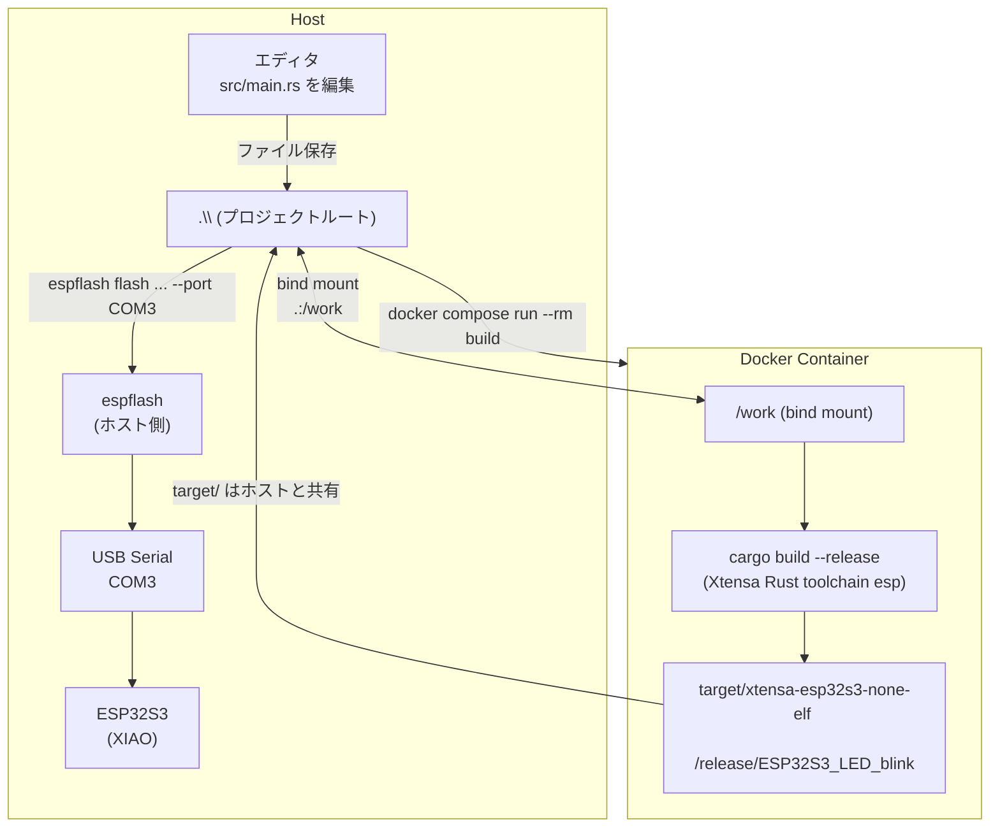

## コマンド早見表

| ステップ | コマンド |
|---|---|
| ビルド (release) | `docker compose run --rm build` |
| ビルド (debug) | `docker compose run --rm build cargo build` |
| ポート確認 | `Get-PnpDevice -Class Ports \| Where-Object Status -eq 'OK' \| Select-Object FriendlyName` |
| 書き込み | `espflash flash .\target\xtensa-esp32s3-none-elf\release\ESP32S3_LED_blink --port COM3` |
| コンテナに入る | `docker compose run --rm --entrypoint bash build` |
