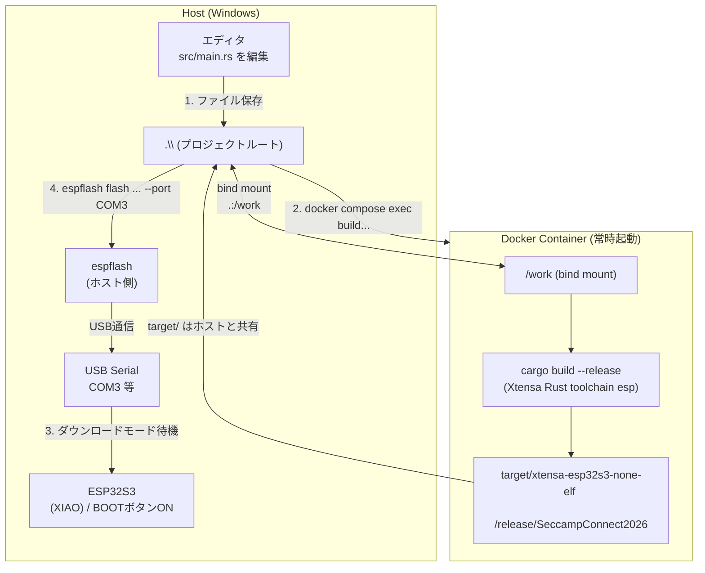

## 開発ワークフロー

### 1. 開発環境の起動
DevContainerが言う事聞いてくれないから、
Dockerでビルド用コンテナを手動で起動します。
```powershell
docker compose up -d
```

### 2. ファームウェアのビルド
起動中のコンテナ内でビルドを実行します。
```powershell
docker compose exec build cargo build --release
```

### 3. デバイスを書き込みモード（ダウンロードモード）にする
**BOOTボタンを押しながら**接続してデバイスをPCに認識させる！

### 4. ポートの確認
デバイスが認識されたら、COMポート番号を確認します。
```powershell
Get-CimInstance Win32_SerialPort | Select-Object Name, Description
```

COMX の部分は、実際に認識されたCOMポート番号に置き換えてね！

```
COM3
```

### 5. ファームウェアの書き込み
ホスト側（Windows）から `espflash` を使ってビルドしたELFファイルを書き込みます。
```powershell
espflash flash .\target\xtensa-esp32s3-none-elf\release\SeccampConnect2026 --port COMX
```

---

## コマンド早見表

| ステップ | コマンド |
|---|---|
| コンテナ起動 | `docker compose up -d` |
| コンテナ停止 | `docker compose down` |
| ビルド (release) | `docker compose exec build cargo build --release` |
| ビルドシェルに入る | `docker compose exec build bash` |
| ポート確認 | `Get-CimInstance Win32_SerialPort \| Select-Object Name, Description` |
| 書き込み | `espflash flash .\target\xtensa-esp32s3-none-elf\release\SeccampConnect2026 --port COMX` |
